# Event-AI: Intelligent Agentic Event Management Ecosystem

**Event-AI** is a cutting-edge, monorepo-based platform that revolutionizes the event planning industry by integrating traditional Vendor Management with advanced **Agentic AI** capabilities. It serves as a bridge between users planning complex events (like weddings, corporate galas) and a curated network of service vendors.

The platform is designed to automate the entire lifecycle of an event: from initial **Concept Discovery** (via AI chat) to **Vendor Selection**, **Booking**, and **Final Execution**.

---

## 🛑 Critical Configuration Notice
> [!IMPORTANT]  
> **Before running the project, you must address the following configuration issues:**
>
> 1.  **Database Authentication**: The default `postgres` password in `packages/backend/.env` often fails on local machines. Update `DATABASE_URL` with your actual local PostgreSQL password.
> 2.  **User Portal Auth**: You must create a `.env` file in `packages/user` with a `NEXTAUTH_SECRET`.
>
> 📜 **See [RECOMMENDED_FIXES.md](./RECOMMENDED_FIXES.md) for step-by-step solutions.**

---

## 🏗️ System Architecture & Workflow

The system is composed of five interconnected applications managed via a **TurboRepo** monorepo structure.

### High-Level Data Flow

```mermaid
graph TD
    User[End User] -->|Chat/Voice| Orchestrator[🐍 AI Orchestrator]
    User -->|Browse/Book| UserPortal[💻 User Portal]
    Vendor[Service Provider] -->|Manage Services| VendorPortal[🏪 Vendor Portal]
    Admin[Platform Admin] -->|Monitor| AdminPortal[⚙️ Admin Portal]
    
    Orchestrator -->|Query Vendors| Backend[🚀 Backend API]
    UserPortal -->|Auth/Bookings| Backend
    VendorPortal -->|Profile/Services| Backend
    AdminPortal -->|Stats/Approval| Backend
    
    Backend -->|Persist Data| DB[(🐘 PostgreSQL)]
    Backend -->|Cache/Queue| Redis[(🔴 Redis)]
```


### Component Breakdown
| Package | Tech Stack | Port | Role & Responsibility |
|---------|------------|------|-----------------------|
| **Backend** | Node.js, Express, Socket.IO | `3001` | **The Brain**: Central REST API. Handles authentication, database interactions, business logic, and real-time socket events. |
| **Orchestrator** | Python, Chainlit, Gemini | `8000` | **The Intelligence**: Uses LLMs (`google-generativeai`) to understand natural language requirements, extract intents, and generate event plans. |
| **Admin Portal** | Next.js (App Dir) | `3002` | **The Control Center**: Dashboard for admins to approve vendors, monitor platform revenue, and manage users. |
| **Vendor Portal** | Next.js (Pages Dir) | `3000` | **The Marketplace**: Interface for vendors (Caterers, Venues, etc.) to list services, set pricing, and view bookings. |
| **User Portal** | Next.js (App Dir) | `3003`* | **The Storefront**: Client-facing app where users browse vendors, view AI-generated plans, and finalize bookings. |

---

## 🌟 Key Features

### 1. 🧠 Agentic Event Planning (AI)
-   **Natural Language Processing**: Users can say *"I want a beach wedding in Karachi for 500 people in December."*
-   **Intent Extraction**: The system parses date, location, budget, and guest count.
-   **Automated Vendor Matching**: The AI queries the backend to find vendors that match the criteria and budget.
-   **Plan Generation**: Produces a structured itinerary and cost estimate.

### 2. 🏪 Dynamic Vendor Management
-   **Service Listings**: Vendors can create detailed profiles with images and distinct service packages.
-   **Booking Management**: Vendors receive real-time updates when they are booked (via Socket.IO).

### 3. 🛡️ Administrative Oversight
-   **User & Vendor Management**: Admins can suspend/approve accounts.
-   **Analytics**: View total revenue, active events, and platform growth.

---

## 🚧 Current Status: What Works & What's Next

### ✅ Fully Implemented
-   **Monorepo Structure**: Efficient code sharing (`@event-ai/ui`) and dependency management (`pnpm`).
-   **Backend implementation**: Complete CRUD for core entities (Users, Vendors, Events).
-   **AI Logic**: Intent extraction and "Greedy" optimizer for vendor selection implemented in Python.
-   **Frontend Portals**: All three web portals (Admin, Vendor, User) are scaffolded and connected to the backend API.

### ⚠️ Works in Progress / Limitations
-   **Authentication Mismatch**: The project is configured for a specific Docker environment (`postgres:postgres`), which causes connection failures on standard local setups. **(Fixable via config)**
-   **AI Integration**: The AI runs in a separate UI (Chainlit). The final vision is to embed this chat window directly inside the **User Portal**.
-   **Payment Gateway**: Not yet integrated; bookings are currently "recorded" but not processed financially.

---

## 🚀 Getting Started Guide

### Prerequisites
-   **Node.js** (v20+)
-   **pnpm** (Install: `npm i -g pnpm`)
-   **Python** (v3.10+)
-   **PostgreSQL** & **Redis** (Local services or Docker)

### 1. Configuration Check
Ensure all `.env` files are created and point to your local database credentials.
-   `packages/backend/.env`
-   `packages/user/.env`
-   `packages/agentic_event_orchestrator/.env`

### 2. Installation
```bash
# From root directory
pnpm install
```

### 3. Running the Infrastructure (Development)

#### 🐧 Linux / macOS
```bash
# Terminal 1: Run the Web Ecosystem (Backend + 3 Portals)
pnpm dev
# (or use `pnpm turbo run dev` for explicit turbo execution)

# Terminal 2: Run the AI Orchestrator
cd packages/agentic_event_orchestrator
python3 -m venv venv
source venv/bin/activate
pip install -r requirements.txt
chainlit run app.py -w
```

#### 🪟 Windows (Powershell)
```powershell
# Terminal 1: Run the Web Ecosystem
pnpm dev

# Terminal 2: Run the AI Orchestrator
cd packages\agentic_event_orchestrator
python -m venv venv
.\venv\Scripts\Activate.ps1
pip install -r requirements.txt
chainlit run app.py -w
```
> **Tip for Windows Users**: If `pnpm dev` hangs or fails, run services individually:
> `pnpm dev --filter=backend`
> `pnpm dev --filter=admin`

---

## 📚 Developed By
Ali & Team - FYP D1
