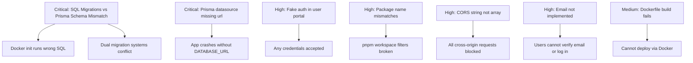

# Event-AI Platform — Issues Audit

## 🛑 Critical Issues

### 1. SQL Migrations vs Prisma Schema Mismatch
**Files:** [`001_initial_schema.sql`](packages/backend/src/db/migrations/001_initial_schema.sql) vs [`schema.prisma`](packages/backend/prisma/schema.prisma)

The raw SQL migrations in `packages/backend/src/db/migrations/` define a **completely different** database schema than the Prisma schema:

| Aspect | SQL Migrations | Prisma Schema |
|--------|---------------|---------------|
| Users table | `users` with `role IN ('USER','VENDOR','ADMIN')` | `vendor_users` with `role IN ('owner','admin','staff','readonly')` |
| Vendors table | Has `user_id` FK to `users` | Has `contact_email` unique, no `user_id` |
| Services categories | `'VENUE','CATERING','PHOTOGRAPHY',...,'SECURITY','OTHER'` (uppercase) | `'venue','catering','photography',...,'staffing','other'` (lowercase, different set) |
| Events table | Has `user_id` FK, `title`, `event_type` with `'WEDDING','CORPORATE',...` | No `user_id`, has `event_type` varchar, `agent_session_id`, AI fields |
| Pricing | `pricing_packages` table | `pricing` table with completely different columns |
| Bookings | `event_vendors` table | `bookings` table with different structure |

The backend code uses Prisma exclusively, so the SQL migrations are **dead code** that would create the wrong schema if run. The `docker-compose.yml` mounts the migrations directory into the Postgres init directory, which means Docker will try to run these incompatible SQL files.

### 2. Dual Migration Systems Conflict
**Files:** [`package.json`](packages/backend/package.json:14-16), [`prisma.config.ts`](packages/backend/prisma.config.ts)

The backend has **two** migration systems configured:
- `node-pg-migrate` (raw SQL in `src/db/migrations/`)
- Prisma Migrate (configured in `prisma.config.ts` pointing to `prisma/migrations/`)

The root [`package.json`](package.json:17-18) scripts call `npm run migrate:up` which runs `node-pg-migrate`, but the app code uses Prisma. There is no `prisma/migrations/` directory — Prisma migrations have never been generated.

### 3. Database Connection — Prisma Missing `url` in Datasource
**File:** [`schema.prisma`](packages/backend/prisma/schema.prisma:9-11)

```prisma
datasource db {
  provider = "postgresql"
}
```

The datasource block has **no `url`** property. Prisma requires either a `url` in the schema or a `DATABASE_URL` env var. The `prisma.config.ts` provides it via `datasource.url`, but this only works for `prisma migrate` commands — the runtime `PrismaClient` still needs `DATABASE_URL` set in the environment. If the backend `.env` is missing or has the wrong password (as noted in [`RECOMMENDED_FIXES.md`](RECOMMENDED_FIXES.md:6-18)), the app will crash.

### 4. Docker Compose Runs Incompatible SQL on Init
**File:** [`docker-compose.yml`](docker-compose.yml:15)

```yaml
volumes:
  - ./packages/backend/src/db/migrations:/docker-entrypoint-initdb.d:ro
```

This mounts **all** SQL migration files into the Postgres init directory. On first start, Postgres will execute them alphabetically. These SQL files create tables (`users`, `vendors`, `services`, etc.) that are **incompatible** with the Prisma schema the app actually uses. This will either cause errors or create a database the app cannot use.

---

## ⚠️ High-Priority Issues

### 5. User Portal NextAuth — Fake Authentication
**File:** [`route.ts`](packages/user/src/app/api/auth/[...nextauth]/route.ts:12-20)

```typescript
async authorize(credentials) {
    // TODO: Replace with actual backend authentication
    if (credentials?.email && credentials?.password) {
        return { id: "1", name: "Event Organizer", email: credentials.email };
    }
    return null;
}
```

The user portal accepts **any email/password combination** as valid. There is no actual authentication against the backend API.

### 6. User Portal API Fallback URL Wrong
**File:** [`api.ts`](packages/user/src/lib/api.ts:3)

```typescript
const API_URL = process.env.NEXT_PUBLIC_API_URL || "http://localhost:3000/api/v1";
```

The fallback URL points to `localhost:3000` (the user portal itself), not `localhost:3001` (the backend). This means if `NEXT_PUBLIC_API_URL` is not set, API calls will loop back to the user portal.

### 7. Socket.IO Hardcoded URL
**File:** [`socket-provider.tsx`](packages/user/src/components/socket-provider.tsx:17)

```typescript
const socketInstance = io("http://localhost:3001", { autoConnect: false });
```

The Socket.IO URL is hardcoded instead of using an environment variable. Additionally, the backend does **not** have Socket.IO set up — there is no `socket.io` dependency in the backend [`package.json`](packages/backend/package.json) and no WebSocket server initialization in [`index.ts`](packages/backend/src/index.ts). This will cause connection errors on the client.

### 8. Backend Package Name Mismatch
**File:** [`package.json`](packages/backend/package.json:2)

The backend package is named `vendor-management-backend` but the root [`package.json`](package.json:9) references it as `@event-ai/backend`. The `pnpm` workspace filter `--filter=@event-ai/backend` will not find the package.

### 9. Frontend/Vendor Portal Package Name Mismatch
**File:** [`package.json`](packages/frontend/package.json:2)

The frontend package is named `vendor-management-frontend` but the root [`package.json`](package.json:12) references it as `@event-ai/vendor`. The `pnpm` workspace filter `--filter=@event-ai/vendor` will not find the package.

### 10. CORS Configuration — String Instead of Array
**File:** [`env.ts`](packages/backend/src/config/env.ts:124-126)

```typescript
cors: {
    origin: env.CORS_ORIGIN, // This is a string like "http://localhost:3000,http://localhost:3001"
}
```

The CORS origin is passed as a raw comma-separated string. In [`index.ts`](packages/backend/src/index.ts:42-47), it's used directly:

```typescript
app.use(cors({ origin: config.cors.origin, ... }));
```

The `cors` middleware expects either a string (single origin), an array of strings, or a function. A comma-separated string like `"http://localhost:3000,http://localhost:3001"` will be treated as a single origin and **will not match any request**, effectively blocking all CORS requests.

### 11. Verify-2FA Route Schema Mismatch
**File:** [`auth.routes.ts`](packages/backend/src/routes/auth.routes.ts:294-324)

The `/verify-2fa` endpoint validates the body against `verify2FASchema` which only expects `{ code: string }`, but the handler destructures `{ email, password, code }` from `req.body`. Since `email` and `password` are not in the schema, they will be stripped by Zod validation, causing the login call to fail.

### 12. Missing `.env` Files for Sub-packages
**Files:** `packages/user/.env`, `packages/admin/.env`, `packages/frontend/.env`, `packages/backend/.env`

None of the sub-packages have actual `.env` files (only `.env.example`). The root `.env` exists but sub-packages may not inherit it depending on how they're started. The user portal specifically needs `NEXTAUTH_SECRET` to function.

---

## 🔶 Medium-Priority Issues

### 13. Vendor Availability Upsert — Broken Prisma Query
**File:** [`vendor.routes.ts`](packages/backend/src/routes/vendor.routes.ts:99-154)

```typescript
const availability = await prisma.vendorAvailability.upsert({
    where: { id: 'placeholder' }, // This will never match
    ...
}).catch(async () => { ... });
```

The upsert uses `id: 'placeholder'` as the where clause, which will never match a UUID. The code relies on the `.catch()` fallback to do a manual find-and-update, but this is an anti-pattern that wastes a database round-trip on every call.

### 14. `DB_NAME` Default Mismatch
**File:** [`env.ts`](packages/backend/src/config/env.ts:13)

```typescript
DB_NAME: z.string().default('vendor_management'),
```

The default database name is `vendor_management`, but the `.env` files and Docker Compose all use `event_ai`. If `DB_NAME` is not set, the app will try to connect to the wrong database.

### 15. Frontend Uses React 18 / Next 14, User Portal Uses React 19 / Next 16
**Files:** [`packages/frontend/package.json`](packages/frontend/package.json:30-31) vs [`packages/user/package.json`](packages/user/package.json:17-19)

| Package | React | Next.js |
|---------|-------|---------|
| `packages/frontend` (vendor portal) | 18.2.0 | 14.x |
| `packages/user` (user portal) | 19.2.3 | 16.1.1 |
| `packages/admin` | likely 19.x | 16.x |

This version split means shared code in `packages/ui` must be compatible with both React 18 and 19, which can cause issues with hooks and server components.

### 16. `packages/ui` Missing Dependencies
**File:** [`packages/ui/package.json`](packages/ui/package.json)

The `packages/ui` exports `cn()` from [`utils.ts`](packages/ui/src/lib/utils.ts) which imports `clsx` and `tailwind-merge`, but these may not be listed as dependencies in the UI package's `package.json`.

### 17. Email Sending Not Implemented
**Files:** [`auth.service.ts`](packages/backend/src/services/auth.service.ts:307), [`auth.routes.ts`](packages/backend/src/routes/auth.routes.ts:28)

Multiple `TODO: Send email` comments indicate email verification and password reset emails are never actually sent. Since login requires `emailVerified: true` ([`auth.service.ts:181`](packages/backend/src/services/auth.service.ts:181)), new users **cannot log in** after registration without manually updating the database.

### 18. `forgotPassword` Returns Token Directly
**File:** [`auth.service.ts`](packages/backend/src/services/auth.service.ts:310)

```typescript
return resetToken; // In production, send via email
```

The password reset token is returned directly in the API response. This is a security issue — the token should only be sent via email.

### 19. Admin Routes — No Platform-Level Admin
**File:** [`admin.routes.ts`](packages/backend/src/routes/admin.routes.ts:9-15)

The admin middleware checks for `role === 'admin' || role === 'owner'`, but these are **vendor-level** roles. There is no concept of a platform-level admin user. Any vendor owner can access admin endpoints and see all vendors/users in the system.

### 20. Metadata Defaults — Default Title/Description
**Files:** [`packages/user/src/app/layout.tsx`](packages/user/src/app/layout.tsx:15-18), [`packages/admin/src/app/layout.tsx`](packages/admin/src/app/layout.tsx:15-18)

Both portals still have the default Next.js metadata:
```typescript
export const metadata: Metadata = {
    title: "Create Next App",
    description: "Generated by create next app",
};
```

---

## 🔵 Low-Priority / Code Quality Issues

### 21. Dockerfile — `npm ci --only=production` Skips Dev Dependencies Needed for Build
**File:** [`packages/backend/Dockerfile`](packages/backend/Dockerfile:12-18)

```dockerfile
RUN npm ci --only=production
COPY . .
RUN npm run build  # This needs typescript (devDependency)
```

The Dockerfile installs only production dependencies, then tries to build with TypeScript which is a dev dependency. The build step will fail.

### 22. Dockerfiles Use `npm` Instead of `pnpm`
**Files:** All Dockerfiles

The project uses `pnpm` as its package manager (see [`package.json`](package.json:32)), but all Dockerfiles use `npm ci` / `npm run build`. This can cause dependency resolution differences and missing workspace dependencies.

### 23. `auth-store.ts` Stores Pending Password in State
**File:** [`auth-store.ts`](packages/frontend/src/lib/auth-store.ts:44)

```typescript
pendingPassword: string | null;
```

The vendor portal stores the user's plaintext password in Zustand state (and potentially in `localStorage` via the persist middleware) during the 2FA flow. This is a security concern.

### 24. No `.gitignore` for Root `.env`
**File:** [`.gitignore`](.gitignore)

The root `.env` file contains placeholder secrets and is tracked in the repository. While the values are placeholders, this pattern can lead to real secrets being committed.

### 25. `packages/frontend` Uses Zod v3, Backend and User Portal Use Zod v4
**Files:** [`packages/frontend/package.json`](packages/frontend/package.json:37) vs [`packages/backend/package.json`](packages/backend/package.json:39)

The vendor portal uses `zod@^3.22.4` while the backend uses `zod@^4.3.6` and the user portal uses `zod@^4.3.5`. Zod v4 has breaking API changes.

---

## Summary



| Severity | Count |
|----------|-------|
| 🛑 Critical | 4 |
| ⚠️ High | 8 |
| 🔶 Medium | 8 |
| 🔵 Low | 5 |
| **Total** | **25** |
